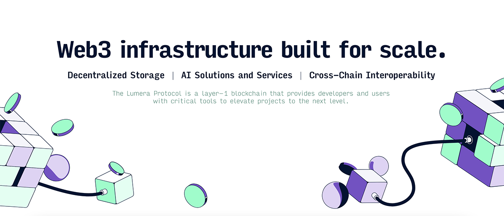

## Lumera Hub

[](LICENSE)
[](https://goreportcard.com/report/github.com/LumeraProtocol/sdk-go)
[](https://github.com/cosmos/cosmos-sdk/releases/tag/v0.53.0)
[](https://github.com/CosmWasm/wasmd/releases/tag/v0.55.0)




**Lumera Protocol** is a next-generation blockchain built for the age of decentralized AI, autonomous agents, and permanent data storage. Formerly known as **Pastel Network**, **Lumera** isn't just another Layer 1 — it's a purpose-built, high-performance foundation for the future of Web3 services.

At its core, **Lumera** combines scalable infrastructure with programmable economic incentives, making it possible for developers, validators, and everyday users to participate in a self-sustaining ecosystem that powers AI-driven applications, censorship-resistant storage, and secure cross-chain interoperability.

---

## Getting Started

### Prerequisites

- Node.js 24+
- pnpm 9+
- For desktop: Rust toolchain
- For mobile: Xcode (macOS) or Android Studio

### Installation

```bash
pnpm install
```

## Development

### Run Dev Servers with Watcher

Run all apps in development mode:

```bash
pnpm dev
```

Run individual apps:

```bash
# Web (Next.js)
pnpm --filter web dev

# Desktop (Tauri)
pnpm --filter desktop tauri dev

# Mobile (Expo)
pnpm --filter mobile start
```

## Build for Deployment

Build all apps:

```bash
pnpm build
```

Build individual apps:

```bash
# Web (Next.js)
pnpm --filter web build

# Desktop (Tauri with static export)
pnpm run build:desktop

# Mobile (Expo EAS)
cd apps/mobile
npx eas build --platform ios  # or android
```

## Run Built Versions Locally

After building:

```bash
# Web
pnpm --filter web start

# Desktop
# The built app is in apps/desktop/src-tauri/target/release/
# Run the executable directly

# Mobile
# For iOS simulator: npx expo run:ios
# For Android emulator: npx expo run:android
# For web preview: npx expo start --web
```

## Deployment

- **Web to Vercel** (recommended): `cd apps/web && npx vercel --prod`
  This builds and deploys the Next.js app directly to Vercel. Vercel handles the server-side rendering, routing, and hosting—no manual steps required. Ensure you're logged in to Vercel CLI (`npx vercel login`) and have linked the project.

- **Web to Other Cloud Hosts** (e.g., VPS with nginx):
  If deploying to a custom cloud host that expects static files (not full Next.js server features), build a static export first:

  ```bash
  cd apps/web
  NEXT_OUTPUT=export pnpm build  # Creates static files in ./out/
  ```

    Copy the ./out/ directory to your remote host (e.g., via SCP, FTP, or cloud storage sync).
    On the remote host, configure nginx (or your web server) to serve the static files:
    Point the server root to the ./out/ directory.

    ```config
    server {
        listen 80;
        server_name hub.lumera.io;
        root /var/www/hub;
        index index.html;
        location / {
            try_files $uri $uri/ /index.html;
        }
    }
    ```

    Restart nginx: sudo systemctl restart nginx.
    Note: This is a static subset—server actions and dynamic features won't work. For full Next.js features, use a host that supports Node.js (like Vercel, Netlify, or Railway).


- **Desktop**: The `pnpm run build:desktop` produces distributable binaries
- **Mobile**: Use EAS builds for app stores

## Scripts

- `pnpm lint`: Lint all code
- `pnpm format`: Format code with Prettier

## Official Website

- 👉 [https://lumera.io/](https://lumera.io/)
- 👉 [https://x.com/lumera](https://x.com/lumera)
- 👉 [https://discord.com/invite/lumeraprotocol](https://discord.com/invite/lumeraprotocol)
- 👉 [https://github.com/LumeraProtocol/](https://github.com/LumeraProtocol/)
- 👉 [https://www.reddit.com/r/LumeraProtocol/?rdt=58979](https://www.reddit.com/r/LumeraProtocol/?rdt=58979)
- 👉 [https://www.youtube.com/@lumeraprotocol](https://www.youtube.com/@lumeraprotocol)
